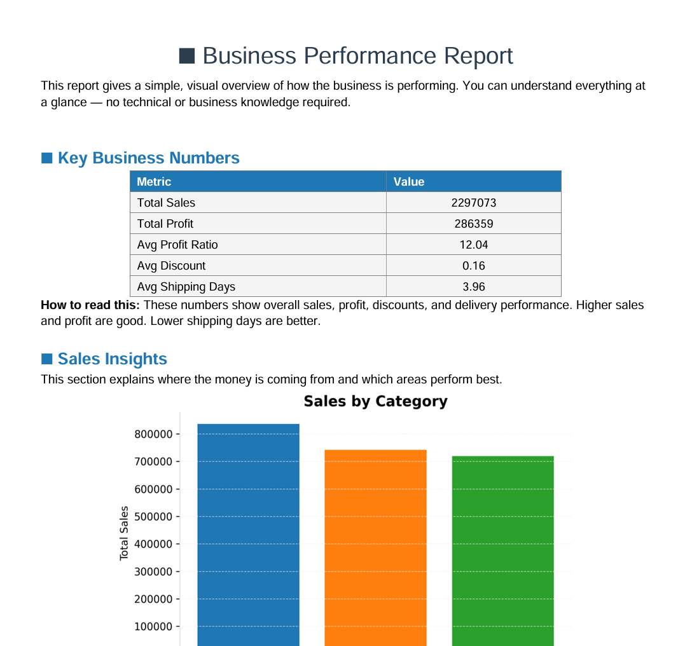
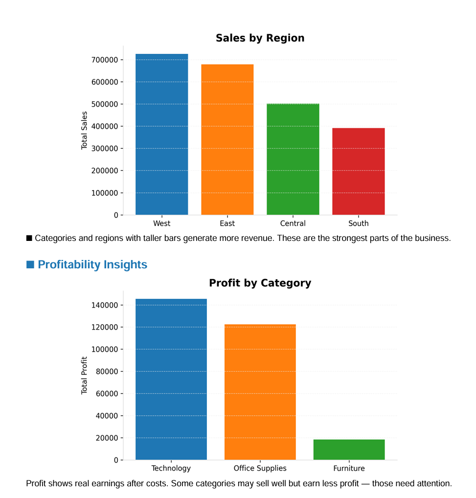
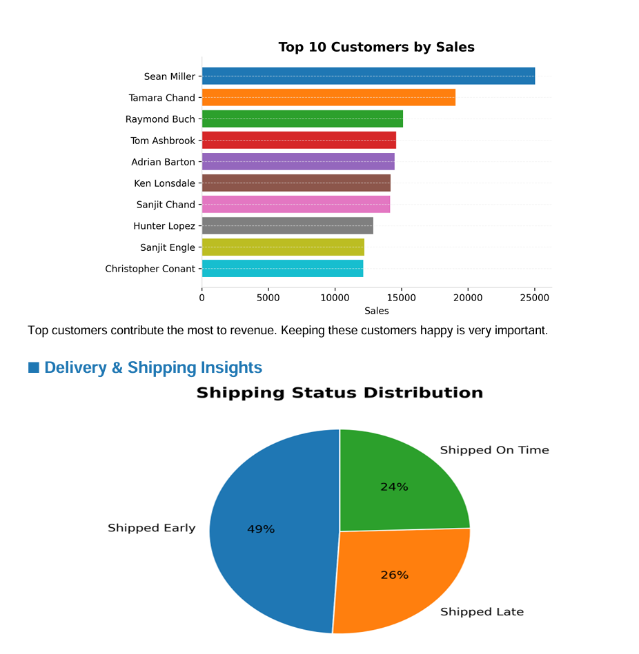
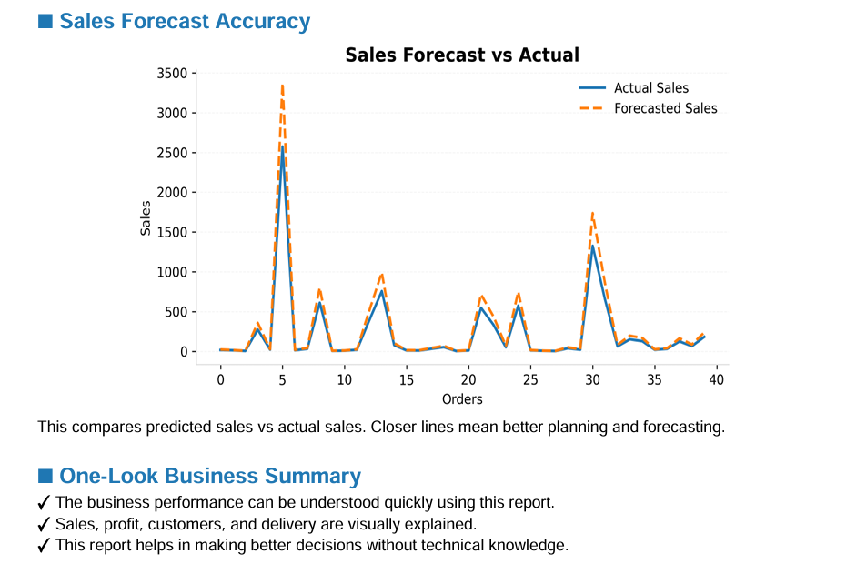

# 📊 Business Insight Report Generator (Python)

A **Python-based data analytics and reporting system** that reads large CSV datasets, analyzes business performance, generates **professional multi-color charts**, and produces an **eye-catching PDF report** that is easy to understand even for **non-technical and non-business users**.

This project demonstrates **real-world data analysis, visualization, and reporting automation**.

---

## 🚀 What This Project Does

✔ Reads large CSV business datasets  
✔ Performs sales, profit, customer, and shipping analysis  
✔ Generates clean, colorful, and PDF-ready charts  
✔ Creates a professional **automated business report (PDF)**  
✔ Designed for **one-time viewers & beginners**  

---

## 🧠 Key Insights in the Report

- 📌 Total Sales & Total Profit  
- 📈 Profitability by Category  
- 🌍 Sales by Region  
- 👥 Top Customers by Sales  
- 🚚 Shipping Performance  
- 🔮 Forecast vs Actual Sales  

All insights are explained visually — no business background required.

---

## 📄 PDF Report Preview

Below are sample screenshots from the generated PDF report:

  
  

  
  

---

## 🛠 Tech Stack

- Python
- Pandas – Data processing
- Matplotlib – Data visualization
- ReportLab – PDF report generation

## 📊 Dataset Details
- Download Dataset : 

▶️ How to Run the Project Locally
1️⃣ Clone the Repository
- git clone https://github.com/Rohit-Patel-Techie/PDF-Report-Generator.git
- cd REPORT-GENERATE-PDF

2️⃣ Create a Virtual Environment (Recommended)
- python -m venv venv

Activate it:
## Windows
- venv\Scripts\activate

## Mac / Linux
- source venv/bin/activate

3️⃣ Install Dependencies
- pip install -r requirements.txt

4️⃣ Run the Project
- python main.py

5️⃣ If all good, PDF will generated and shown on 
- src/reports/Business_Insight_Report.pdf

